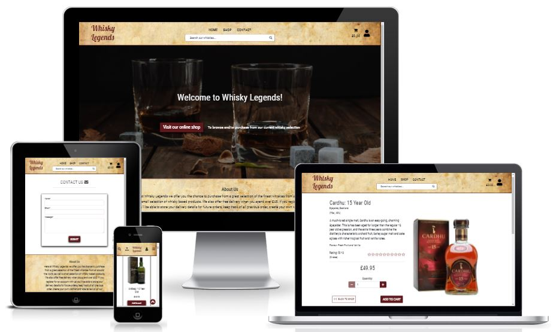
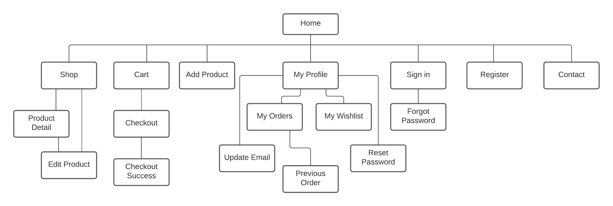
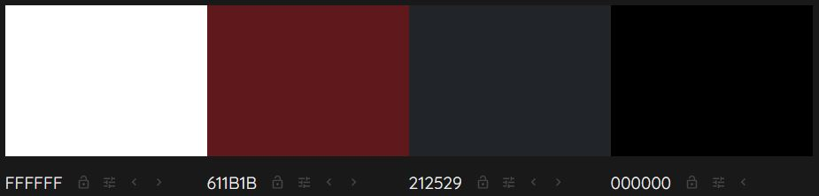

# Whisky Legends

[Click here to view the live site.](https://whisky-legends.herokuapp.com/)

## Contents

- [Overview](#overview)
- [User Experience (UX)](#user-experience)
    - [Strategy](#strategy)
    - [Scope](#scope)
    - [Structure](#structure)
    - [Skeleton](#skeleton)
    - [Surface](#surface)
- [Features](#features)
    - [Existing Features](#existing-features)
- [Testing](#testing)
    - [User Stories Testing](#user-stories-testing)
    - [Validator Testing](#validator-testing)
    - [Performance Testing](#performance-testing)
    - [Device and Browser Compatibility Testing](#device-and-browser-compatibility-testing)
    - [Bugs](#bugs)
- [Deployment](#deployment)
- [Technologies Used](#technologies-used)
    - [Languages](#languages)
    - [Online Resources](#online-resources)
- [Credits](#credits)
    - [Code](#code)
    - [Media](#media)

## Overview

Whisky Legends is an ecommerce website that sells an array of whiskies from all over the world. A subscription service is also available, offering users the chance of sampling different whiskies on a monthly basis. There are 3 subscription lengths: 3 months, 6 months and 12 months. Users will also be able to register for an account which will provide them access to their own profile, order history and wishlist functionality. Registered users will also be able to rate and review whiskies they have previously purchased.

## User Experience

### Strategy

This website is aimed at whisky fans who would like to purchase one or multiple bottles of whisky, and/or who would like to sample different whiskies every month over a chosen subscription period.

#### Marketing Strategy

The marketing strategy for this site uses a combination of Email Marketing, Social Media Marketing and Search Engine Optimisation.

Users can subscribe to the site's mailing list by submitting their email address via a simple MailChimp form in the site's footer.

A [Facebook business page](https://www.facebook.com/Whisky-Legends-113839797954063) has been created which is also linked to in the footer of the site, where users are encourged to visit and follow the page.

##### Search Engine Optimisation

To optimise how search engines will view this site, a number of short and long tail keywords are needed. After some research using Google's 'People always ask' and 'Related Searches' features, a list of 10-20 short and long tail keywords were discovered and have been placed in the keywords meta tag in the head of the main html document.

#### Epics and User Stories

The project has been split up into 5 epics, each of which have been split up into multiple user stories. All of which are outlined below.

More detail about the user stories including acceptance criteria and tasks associated with each of them can be found in the [issues](https://github.com/AshFoster/whisky-legends/issues) section of the GitHub repository.

  - __Epic 1: Admin and Store Management__
      - As a store owner I want to be able to add a product so that I can add new items to my store
      - As a store owner I want to be able to edit/update a product so that I can change product prices, descriptions, images and other product criteria
      - As a store owner I want to be able to delete a product so that I can remove items that are no longer for sale
      - As a store owner I want to be able to approve product reviews so that I can filter out any questionable reviews
      - As a store owner I want to be able to delete product reviews so that I can delete any reviews that are no longer relevant
      - As a store owner I want to be able to be notified when a review/comment needs to be approved so that I can avoid the need to keep checking the admin site for anything to be approved
      - As a store owner I want to be able to be notified when a user has submitted the contact form so that I can avoid the need to keep checking the admin site for any contact form submissions to read

  - __Epic 2: User Accounts__
      - As a site user I want to be able to easily register for an account so that I can have a personal account and be able to view my profile
      - As a registered site user I want to be able to easily log in or log out so that I can access my personal account information
      - As a registered site user I want to be able to easily recover my password in case I forget it so that I can recover access to my account
      - As a registered site user I want to be able to receive an email confirmation after registering so that I can verify that my account registration was successful
      - As a registered site user I want to be able to update the email address linked to my account so that I can use a new email address with my account
      - As a registered site user I want to be able to update my password so that I can strengthen my password or use a more memorable password
      - As a registered site user I want to be able to have a personalised user profile so that I can view my personal order history and order confirmations, and save my payment information
      - As a registered site user I want to be able to write reviews of whiskies or other products so that I can share my opinion about products with other users
      - As a registered site user I want to be able to update/edit any product reviews I've written so that I can amend any mistakes I might have made or add further detail
      - As a registered site user I want to be able to delete any product reviews I've written so that I can remove any reviews I no londer wish to share
      - As a registered site user I want to be able to rate whiskies or other products that I've purchased so that I can show other users how much I like or dislike them
  
  - __Epic 3: Browsing and Navigation__
      - As a site user I want to be able to view a list of whiskies and other available products so that I can select something to purchase
      - As a site user I want to be able to view individual whiskies or other products details so that I can identify its price, description, rating and image
      - As a site user I want to be able to quickly identify deals and/or special offers so that I can take advantage of special savings on whiskies I'd like to purchase
      - As a site user I want to be able to easily view the total of my purchases at any time so that I can avoid spending too much
      - As a site user I want to be able to view the site's privacy policy so that I can see what information is collected about me and how it is used
      - As a site user I want to be able to click a link to the site's facebook business page so that I can follow them on facebook
      - As a site user I want to be able to sign up to the site's newsletter so that I can receive the latest newsletters as soon as they're released
      - As a site user I want to be able to fill in a contact form so that I can get in contact with the site owners to ask any questions I might have
      - As a site user I want to be able to read customer reviews on whiskies or other products so that I can see what other customers have to say about them
      - As a site user I want to be able to view ratings of whiskies or other products so that I can see which have the highest and lowest ratings

  - __Epic 4: Filtering, Sorting and Searching__
      - As a site user I want to be able to sort the list of available whiskies and other products so that I can easily identify the best rated, best priced and regionally sorted whiskies
      - As a site user I want to be able to filter on a specific category/categories of whisky so that I can easily identify whiskies of a particular category/categories
      - As a site user I want to be able to sort a specific category of whisky so that I can find the best priced or best rated whisky from a specific category or sort the whiskies in that category by name
      - As a site user I want to be able to sort multiple categories of whiskies simultaneously so that I can find the best priced or best rated whiskies across broad categories such as "region" or "type"
      - As a site user I want to be able to search for a whisky or other product by name or description so that I can find a specific whisky or other product I'd like to purchase
      - As a site user I want to be able to easily see what I've searched for and the number of results so that I can quickly decide whether the whisky or other product I want is available

  - __Epic 5: Purchasing and Checkout__
      - As a site user I want to be able to easily add whiskies and/or other products to my shopping cart so that I can keep track of multiple items I'd like to purchase together
      - As a site user I want to be able to easily select the quantity of a whisky or other product when purchasing it so that I can ensure I don't accidentally select the wrong product quantity
      - As a site user I want to be able to view items in my cart to be purchased so that I can identify the total cost of my purchase and all items I will receive
      - As a site user I want to be able to adjust the quantity of individual items in my cart so that I can easly make changes to my purchase before checkout
      - As a site user I want to be able to put whiskies into a personal wishlist so that I can keep track of whiskies that I'd like to purchase in the furture
      - As a site user I want to be able to remove items from personal wishlist so that I can remove items that I've now purchased or no longer wish to purchase in the future
      - As a site user I want to be able to easily enter my payment information so that I can check out quickly and with no hassle
      - As a site user I want to be able to feel my personal and payment information is safe and secure so that I can confidentily provide the needed information to make a purchase
      - As a site user I want to be able to view an order confirmation after checkout so that I can verify that I haven't made any mistakes
      - As a site user I want to be able to recieve an email confirmation after checking out so that I can keep the confirmation of what I've purchased for my records

### Scope

### Structure

#### Data Models

##### App Models

### Skeleton

#### Wireframes

Wireframes were created for mobiles, tablets, and desktops using [Balsamiq](https://balsamiq.com/). The actual pages do differ slightly from the original wireframes.

Here are links to each of them:

- [Desktop - Home](assets/wireframes/home-desktop.png)
- [Tablet - Home](assets/wireframes/home-tablet.png)
- [Mobile - Home](assets/wireframes/home-mobile.png)
- [Desktop - Shop](assets/wireframes/shop-desktop.png)
- [Tablet - Shop](assets/wireframes/shop-tablet.png)
- [Mobile - Shop](assets/wireframes/shop-mobile.png)

### Surface

#### Imagery

#### Colour Scheme

#### Typography

For the typography choices, [Google Fonts](https://fonts.google.com/?sort=popularity) was used, sorted by popularity to give an idea of some fonts that are likely to work well across many websites.

The ones that stood out and seemed most suited to the project were chosen. They are as follows:

Each of them is of the font category Sans Serif which is the font used as a fallback if for any reason the specified font isn't available.

## Features

### Existing Features

- __Navbar__

  

## Testing

### User Stories Testing

#### Epic 1:

### Validator Testing

- __HTML__

  - Originally, a few errors were showing up when the site was put through the [W3C Markup Validation Service.](https://validator.w3.org/), but they have all since been rectified and now no errors are showing on any of the pages.

- __CSS__

  - No errors were found when put through the [W3C CSS Validation Service - Jigsaw.](https://jigsaw.w3.org/css-validator/)

- __JavaScript__

  - No errors were found when put through the [JSHint.](https://jshint.com/)

- __Python__

  - All python files have been put through the [PEP8 linter](http://pep8online.com/). Any issues that were found due to long lines, trailing whitespace etc. have been rectified and no errors are now showing.

### Performance Testing

The website was audited for mobile and desktop using Google Chrome's lighthouse feature.

[WAVE Evaluation Tool](https://wave.webaim.org/) was used to test the accessibility across all the pages of the site.

### Device and Browser Compatibility Testing

To test the site's compatibility across a range of devices [Responsinator](https://www.responsinator.com/) was used, going through all of the user stories on each device it includes in both portrait and landscape modes. The devices included are as follows:

  - iPhone X
  - Pixel 2
  - iPhone 6-8
  - iPhone 6-8 Large Version
  - iPad

Chrome Dev Tools was also used to check the site's compatibility across a range of other devices also in both portrait and landscape modes. These devices include:

  - Ipad Pro
  - Galaxy Fold (which has a very narrow viewport of only 280px in portrait mode)

Actual mobile devices belonging to family and friends were also used for testing which includes the following:

  - iPhone 7
  - Pixel 4
  - S10 Plus

A desktop monitor was also used for testing with a couple of different resolutions to check that the site remains to look and act as expected on larger screens. The resolutions were: 1366 x 768 and 1920 x 1080.

Google Chrome was the browser used for the majority of testing during the development process, but once development had neared an end some other browsers were used for testing to make sure the site had cross-browser compatibility. The full list of browsers used for testing are as follows:

  - Chrome
  - Edge
  - Firefox

### Bugs

#### Fixed Bugs

- On the 'ages' dropdown in the filtering section of shop.html the 'dictsort' function was treating the integer values as string values which meant that the order of the whisky ages was not correct in the dropdown. This was caused because some of the products did not have 'age' values and were therefore of 'None' type. This was fixed by not adding these products to the 'ages' dictionary created within the get_context_data function in views.py.

- If a product did not have a region associated with it then an error was caused in views.py when trying to add it to the regions dictionary. This was fixed by adding an if statement that only tried to add to the dictionary if a region exists for the product.

#### Unfixed Bugs

- 

## Deployment

[Here's a link to the live site.](https://whisky-legends.herokuapp.com/)

### Deploying with Heroku

This project has been deployed on Heroku using the following steps:
 
- Log into Heroku or create an account.
- Create a new Heroku App with an appropriate name and region.
- Once created go to the Resources tab, then under Add-ons search and add 'Heroku Postgres’.
- Then go to the Settings tab and click Reveal Config Vars.
- Add the following variables as config vars:
  - SECRET_KEY - can be any key you like
  - EMAIL_HOST_USER - must be the email address associated with a SendGrid account
- Now go to the Deploy tab.
- Connect to Github using the relevant repository name.
- Then click 'Deploy a GitHub branch' under the Manual deploy section.
- Once confirmation of deployment is shown, the project is now deployed and can be opened.

### Forking or Cloning the GitHub Repository

To deploy this application, fork or clone the [repository](https://github.com/AshFoster/whisky-legends), then follow the steps outlined in the '[Deploying with Heroku](#deploying-with-heroku)' section above.

#### Forking the Repository

To fork the GitHub repository follow these steps:

- Log in to GitHub and navigate to the [repository](https://github.com/AshFoster/whisky-legends).
- Once the page has loaded look for the "Fork" button near the top right of the page and click it.
- A copy of the original repository should now be in your GitHub account.

#### Cloning the Repository

To clone the GitHub repository follow these steps:

- Log in to GitHub and navigate to the [repository](https://github.com/AshFoster/whisky-legends).
- Above the repository's list of files, on the right, click on the "Code" button.
- Copy the link that is shown in the drop-down list.
- Open Git Bash and change the current working directory to the location where you want the cloned directory to be made.
- In the terminal, type `git clone`, and then paste the URL you copied earlier and press enter.
- A local clone of the original repository should now be available.

## Technologies Used

### Languages

- [HTML5](https://en.wikipedia.org/wiki/HTML5)
- [CSS3](https://en.wikipedia.org/wiki/CSS)
- [JavaScript](https://en.wikipedia.org/wiki/JavaScript)
- [Python](https://en.wikipedia.org/wiki/Python_(programming_language))

### Frameworks

- [Django](https://www.djangoproject.com/)
- [Bootstrap 5](https://getbootstrap.com/)

### Online Resources

- [Git](https://en.wikipedia.org/wiki/Git) - for version control.
- [GitPod](https://www.gitpod.io/) - the online IDE (Integrated Development Environment) used for development.
- [GitHub](https://github.com/) - used as an online code repository.
- [Heroku](https://www.heroku.com/) - used for deployment.
- [Google Fonts](https://fonts.google.com/) - for the fonts used throughout the site.
- [Font Awesome](https://fontawesome.com/) - for the icons used throughout the site.
- [Colormind](http://colormind.io/) - used to obtain colour palette images.
- [SendGrid](https://sendgrid.com/) - used to send emails when required.
- [Lucidchart](https://www.lucidchart.com/) - used to create site map and entity relationship diagrams.
- [Logo Pony](https://logopony.co.uk/) - To create default product image
- [Red Ketchup Image Resizer](https://redketchup.io/image-resizer) - To resize default product image

## Credits

### Code

- [YouTube](https://www.youtube.com/)
- [Code Institute's Full Stack Developer Course](https://codeinstitute.net/)
  - Course material and walkthrough projects provided some ideas.