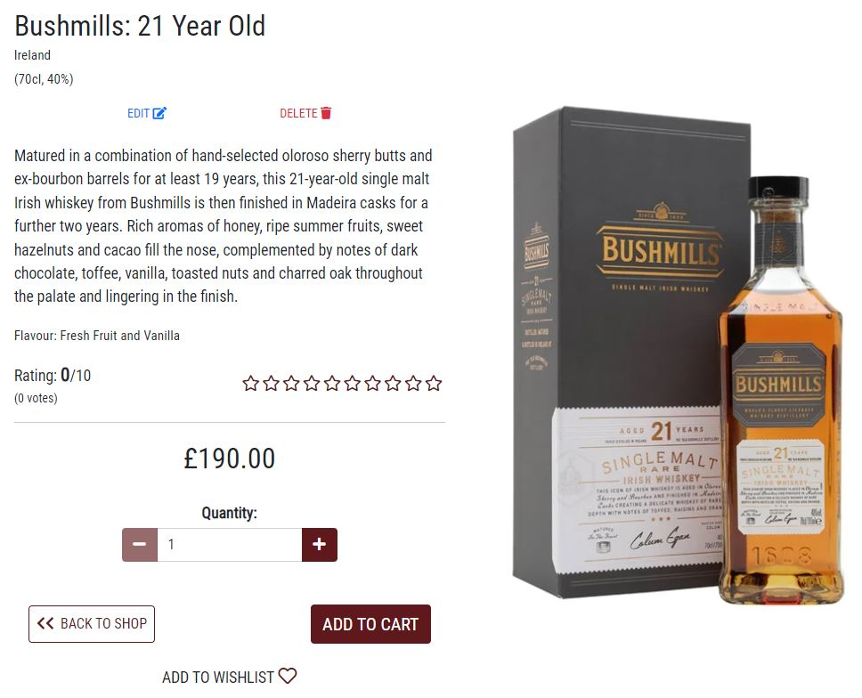

# Whisky Legends

[Click here to view the live site.](https://whisky-legends.herokuapp.com/)

## Contents

- [Overview](#overview)
- [User Experience (UX)](#user-experience)
    - [Strategy](#strategy)
    - [Scope](#scope)
    - [Structure](#structure)
    - [Skeleton](#skeleton)
    - [Surface](#surface)
- [Features](#features)
    - [Existing Features](#existing-features)
- [Testing](#testing)
    - [User Stories Testing](#user-stories-testing)
    - [Validator Testing](#validator-testing)
    - [Performance Testing](#performance-testing)
    - [Device and Browser Compatibility Testing](#device-and-browser-compatibility-testing)
    - [Bugs](#bugs)
- [Deployment](#deployment)
- [Technologies Used](#technologies-used)
    - [Languages](#languages)
    - [Online Resources](#online-resources)
- [Credits](#credits)
    - [Code](#code)
    - [Media](#media)

## Overview

Whisky Legends is an e-commerce website that sells an array of whiskies from all over the world, as well as a small selection of whisky-related products. Users are able to register for an account which provides them with access to their own profile where they are able to store personal and delivery information, view their order history, and view their own wishlist. Registered users are also able to rate and review any of the whiskies/products on the site.

The Stripe account associated with this project is set to 'test' mode, so to make payments on the site one of Stripe's test cards will need to be used, 2 of which are outlined below.

4242 4242 4242 4242 - to simulate standard payments

4000 0025 0000 3155 - to simulate 3D Secure authentication payments

Then use any future date and any 3-digit CVC code.

## User Experience

### Strategy

This website is aimed at whisky fans who would like to purchase one or multiple bottles of whisky, and/or some whisky-related products.

#### Business Model

The business model for this e-commerce website is a 'B2C – Business to customer' model. Non of the products sold are made or developed by Whisky legends, so everything is bought at wholesale prices in order to sell to customers at a profit. With this in mind the site has been designed to make everything as easy as possible for customers visiting the site. Everthing is designed to be easily found and understood, with the aim of producing a positive response from the site's users.

#### Marketing Strategy

The marketing strategy for this site uses a combination of Email Marketing, Social Media Marketing and Search Engine Optimisation.

Users can subscribe to the site's mailing list by submitting their email address via a simple MailChimp form in the site's footer.

A [Facebook business page](https://www.facebook.com/Whisky-Legends-113839797954063) has been created which is also linked to in the footer of the site, where users are encourged to visit and follow the page. An image of the page can be found [here](assets//readme-images/fb-full.JPG).

##### Search Engine Optimisation

To optimise how search engines will view this site, a number of short and long tail keywords are needed. After some research using Google's 'People always ask' and 'Related Searches' features, a list of 10-20 short and long tail keywords were discovered and have been placed in the keywords meta tag in the head of the main html document.

#### Epics and User Stories

The project has been split up into 5 epics, each of which have been split up into multiple user stories. All of which are outlined below.

More detail about the user stories including the acceptance criteria associated with each of them can be found in the [issues](https://github.com/AshFoster/whisky-legends/issues) section of the GitHub repository.

  - __Epic 1: Admin and Store Management__
      - As a store owner I want to be able to add a product so that I can add new items to my store
      - As a store owner I want to be able to edit/update a product so that I can change product prices, descriptions, images and other product criteria
      - As a store owner I want to be able to delete a product so that I can remove items that are no longer for sale
      - As a store owner I want to be able to delete product reviews so that I can delete any reviews that are no longer relevant
      - As a store owner I want to be able to be notified when a user has submitted the contact form so that I can avoid the need to keep checking the admin site for any contact form submissions to read

  - __Epic 2: User Accounts__
      - As a site user I want to be able to easily register for an account so that I can have a personal account and be able to view my profile
      - As a registered site user I want to be able to easily log in or log out so that I can access my personal account information
      - As a registered site user I want to be able to easily recover my password in case I forget it so that I can recover access to my account
      - As a registered site user I want to be able to update the email address linked to my account so that I can use a new email address with my account
      - As a registered site user I want to be able to update my password so that I can strengthen my password or use a more memorable password
      - As a registered site user I want to be able to have a personalised user profile so that I can view my personal order history and order confirmations, and save my delivery information
      - As a registered site user I want to be able to put whiskies into a personal wishlist so that I can keep track of whiskies that I'd like to purchase in the future
      - As a registered site user I want to be able to remove items from personal wishlist so that I can remove items that I've now purchased or no longer wish to purchase in the future
      - As a registered site user I want to be able to write reviews of whiskies or other products so that I can share my opinion about products with other users
      - As a registered site user I want to be able to delete any product reviews I've written so that I can remove any reviews I no londer wish to share
      - As a registered site user I want to be able to rate whiskies or other products that I've purchased so that I can show other users how much I like or dislike them
  
  - __Epic 3: Browsing and Navigation__
      - As a site user I want to be able to view a list of whiskies and other available products so that I can select something to purchase
      - As a site user I want to be able to view individual whiskies or other products details so that I can identify its price, description, rating and image
      - As a site user I want to be able to easily view the total of my purchases at any time so that I can avoid spending too much
      - As a site user I want to be able to view the site's privacy policy so that I can see what information is collected about me and how it is used
      - As a site user I want to be able to click a link to the site's facebook business page so that I can follow them on facebook
      - As a site user I want to be able to sign up to the site's newsletter so that I can receive the latest newsletters as soon as they're released
      - As a site user I want to be able to fill in a contact form so that I can get in contact with the site owners to ask any questions I might have
      - As a site user I want to be able to read customer reviews on whiskies or other products so that I can see what other customers have to say about them
      - As a site user I want to be able to view ratings of whiskies or other products so that I can see which have the highest and lowest ratings

  - __Epic 4: Filtering, Sorting and Searching__
      - As a site user I want to be able to sort the list of available whiskies and other products so that I can easily identify the best rated, best priced and alphabetically sorted whiskies
      - As a site user I want to be able to filter on a specific category/categories of whisky so that I can easily identify whiskies of a particular category/categories
      - As a site user I want to be able to sort a specific category of whisky so that I can find the best priced or best rated whisky from a specific category or sort the whiskies in that category by name
      - As a site user I want to be able to sort multiple categories of whiskies simultaneously so that I can find the best priced or best rated whiskies across broad categories such as "region" or "type"
      - As a site user I want to be able to search for a whisky or other product by name or description so that I can find a specific whisky or other product I'd like to purchase
      - As a site user I want to be able to easily see what I've searched for and the number of results so that I can quickly decide whether the whisky or other product I want is available

  - __Epic 5: Purchasing and Checkout__
      - As a site user I want to be able to easily add whiskies and/or other products to my shopping cart so that I can keep track of multiple items I'd like to purchase together
      - As a site user I want to be able to easily select the quantity of a whisky or other product when purchasing it so that I can ensure I don't accidentally select the wrong product quantity
      - As a site user I want to be able to view items in my cart to be purchased so that I can identify the total cost of my purchase and all items I will receive
      - As a site user I want to be able to adjust the quantity of individual items in my cart so that I can easly make changes to my purchase before checkout
      - As a site user I want to be able to access a checkout page so that I can purchase products from the shop
      - As a site user I want to be able to easily enter my delivery and payment information so that I can check out quickly and with no hassle
      - As a site user I want to be able to view an order confirmation after checkout so that I can verify that I haven't made any mistakes
      - As a site user I want to be able to recieve an email confirmation after checking out so that I can keep the confirmation of what I've purchased for my records

### Scope

All of the user stories outlined above are feasible for the first release of the website. Some further features that could be implemented later on include:

- Providing store owners with the ability to add new brands, countires, flavours etc from the front end instead of having to do this via the Django admin panal.
- Adding a 'load more' button to the shop page to prevent the need to load all products each time the page is visited.

Having these features will not impact the user experience too much, so it is fine to exclude them for the first release.

### Structure

The structure of the website is aimed to be as simple as possible whilst showing all the necessary information. The main parts of the site will be accessible from the navbar, with any other parts easily accessible from the relevant pages. The main parts of the site included within the navbar are as follows:

- Home
- Shop
- Contact
- Cart
- Register
- Login
- Product Management (store owners only) - this link takes the user to the 'Add Product' page
- My Profile (registered users only)
- Sign Out (registered users only)

Other parts of the site not included in the navbar are as follows:

- Product detail (accessed from shop page and users' wishlist pages)
- Checkout (accessed from cart page)
- Checkout Success (accessed after successful checkout submission)
- Edit Product (store owners only - accessed from shop page and product detail page)
- Delete Product (store owners only - accessed from shop page and product detail page - confirmation modal is shown - redirects on confirmation)
- Delete Review (store owners and reviewer only - accessed from product detail page - confirmation modal is shown - redirects on confirmation)
- My Orders (registered users only - accessed from 'My Profile' page)
- Previous Order (registered users only - accessed from 'My Orders' page)
- My Wishlist (registered users only - accessed from 'My Profile' page or via success toast when adding to wishlist)
- Update Email (registered users only - accessed from 'My Profile' page)
- Update Password (registered users only - accessed from 'My Profile' page)
- Reset Password (registered users only - accessed from sign in page)
- 404 Error
- 500 Error

The site has been split up into 6 apps: cart, checkout, contact, home, profiles and shop.

- The cart app handles everything to do with viewing, adding, updating and rremoving from the cart.
- The checkout app handles everything to do with processing payments and interacting with stripe.
- The contact app handles the contact form.
- The home app handles the home page, 404 error page and 500 error page.
- The profiles app handles the user profile, order history and wishlist functionality and pages.
- The shop app handles viewing, filtering, sorting, reviewing, adding, updating and deleting products.

The site map can be seen in the following image:

#### Data Models

Throughout development and deployment the same Heroku Postgres database has been used to store all necessary data for the site. 11 custom models have been created across 3 of the site's apps, Checkout, Profiles and Shop.

##### Checkout App Models

The Checkout app has 2 database models associated with it: Order and OrderLineItem.

- The Order model stores all the necessary data needed for an individual order, including order number, delivery info, date and costs etc. It also has a many to one relationship with the UserProfile model (described below in [Profiles App Models](#profiles-app-models)). The 'Original Cart' and 'Stripe PID' fields are used in conjunction with Stripe Webhooks to prevent duplicate orders from being created if the user is somehow disconnected whilst a payment is being processed.

- The OrderLineItem model stores individual line items associated with an order, including quantity and cost. It has a many to one relationship with the Order model and also has a many to one relationship with the Product model (described below in [Shop App Models](#shop-app-models)). There will be an order line item instance for each product in an order.

##### Profiles App Models

The Profiles app has 2 database models associated with it: UserProfile and Wishlist.

- The UserProfile model has a one to one relationship with Django's built-in User model, and has a variety of other fields used to store user's default name and delivery details etc.

- The Wishlist table has a one to one relationship with Django's built-in User model as well as a many to many relationship with the Product model (described below in [Shop App Models](#shop-app-models)). Each user can have an individual wishlist that can contain multiple products.

##### Shop App Models

The Shop app has 7 database models associated with it: Type, Brand, Country, Region, Flavour, Product and Review.

The Type model is used to store all available product types.

The Brand model is used to store all available product brands. It has many to one relationships with the Country and Region models.

The Country model is used to store all available countries.

The Region model is used to store all available regions.

The Flavour model is used to store all available whisky flavours.

The Product model is used store all the necessary information associated with an individual product. It has many to one relationships with the Type, Brand and Flavour models, as well as fields to store info such as name, description etc.

The Review model has many to one relationships with Django's built-in User model and with the Product model. Its other fields store review related information including rating, content and date.

##### Database Schema

Here is an image showing how all of the site's models relate to each other.

### Skeleton

#### Wireframes

Wireframes were created for mobiles, tablets, and desktops using [Balsamiq](https://balsamiq.com/). The actual pages do differ slightly from the original wireframes.

Here are links to each of them:

- [Desktop - Home](assets/wireframes/home-desktop.png)
- [Tablet - Home](assets/wireframes/home-tablet.png)
- [Mobile - Home](assets/wireframes/home-mobile.png)
- [Desktop - Shop](assets/wireframes/shop-desktop.png)
- [Tablet - Shop](assets/wireframes/shop-tablet.png)
- [Mobile - Shop](assets/wireframes/shop-mobile.png)
- [Desktop - Product Detail](assets/wireframes/product-detail-desktop.png)
- [Tablet - Product Detail](assets/wireframes/product-detail-tablet.png)
- [Mobile - Product Detail](assets/wireframes/product-detail-mobile.png)
- [Desktop - Cart](assets/wireframes/cart-desktop.png)
- [Tablet - Cart](assets/wireframes/cart-tablet.png)
- [Mobile - Cart](assets/wireframes/cart-mobile.png)
- [Desktop - Checkout](assets/wireframes/checkout-desktop.png)
- [Tablet - Checkout](assets/wireframes/checkout-tablet.png)
- [Mobile - Checkout](assets/wireframes/checkout-mobile.png)
- [Desktop - Profile](assets/wireframes/profile-desktop.png)
- [Tablet - Profile](assets/wireframes/profile-tablet.png)
- [Mobile - Profile](assets/wireframes/profile-mobile.png)
- [Desktop - Orders](assets/wireframes/orders-desktop.png)
- [Tablet - Orders](assets/wireframes/orders-tablet.png)
- [Mobile - Orders](assets/wireframes/orders-mobile.png)
- [Desktop - Wishlist](assets/wireframes/wishlist-desktop.png)
- [Tablet - Wishlist](assets/wireframes/wishlist-tablet.png)
- [Mobile - Wishlist](assets/wireframes/wishlist-mobile.png)
- [Desktop - Contact](assets/wireframes/contact-desktop.png)
- [Tablet - Contact](assets/wireframes/contact-tablet.png)
- [Mobile - Contact](assets/wireframes/contact-mobile.png)

### Surface

#### Imagery

An image of old paper has been used as the background of the header, footer, modals and some menu dropdowns. This provides a somewhat old fashioned feel which helps portray the whisky related theme.

#### Colour Scheme

The colour scheme of the site is very simple, with the main colours being white, a shade of red, a shade of black, and black itself with various levels of opacity. The shade of red further helps with the whisky related theme.

#### Typography

For the typography choices, [Google Fonts](https://fonts.google.com/?sort=popularity) was used, sorted by popularity to give an idea of some fonts that are likely to work well across many websites.

The ones that stood out and seemed most suited to the project were chosen. They are as follows:

Lobster - This is used for the Whisky Legends logo shown on the navbar.

Roboto Condensed - This is used for all other text throughout the site.

Lobster is of the font category 'Cursive' and Roboto Condensed is of the font category Sans Serif. The font categories will be used as a fallback if for any reason a specified font isn't available.

## Features

### Existing Features

- __Navbar__

  

  - The navbar is fixed at the top of the screen so the user always has easy access to it.
  - It has the website brand on the left-hand side which is also a link to the homepage. It also has links to all the major sections of the website across the middle.
  - These menu items are displayed using a hamburger menu on smaller screens.
  - Below is a search bar which when used takes the user to the 'Shop' page with any search results that may have been found. On smaller screens this is hidden and a search icon is displayed which when clicked makes the search bar appear below.
  - On the right-hand side there is a cart icon and an account icon. The cart icon has a number below it indicating the current value the cart, and when clicked takes the user to the 'Cart' page. The account icon, when clicked, opens up a small dropdown menu showing 'register' and 'login' to users that aren't logged in, and 'my profile' and 'logout' to users that are. If a super user is logged in they will also see a 'product management' link, which takes them to a page where they can add products.
  - When on each of the pages shown within the navbar the relevant link is bold and brighter to show the user which part of the site they're currently viewing.

- __Footer__

  

  - The footer is split up into 3 main sections. One shows a small paragraph describing what Whisky Legends is all about. One contains an input box which allows the user to subscribe to the site's newsletter, and the other shows a link to the site's facebook business page.
  - Below these there is a link to display the site's privacy policy modal, and right at the bottom copyright-related information is displayed.

- __Home page__

  

  - Here, the user is welcomed to the site. A button is also displayed suggesting for them to visit the site's online shop.
  - An image of some whisky glasses is shown behind to futher show that the site is whisky related.
  
- __Shop page__

  

  - The shop page displays all of the products that the site has for sale. Each product is contained within its own card which contain an image, the product's name, its price and an 'add to cart' button. The image and the name can be clicked to take the user to the product detail page of that particular product. The 'add to cart' button does as it says, after which a bootstrap toast is displayed containing a message letting the user know that they've added to their cart successfully, as well as showing the current contents of their cart.
  - When logged in as a superuser each product has 'edit' and 'delete' buttons. The 'edit button takes the user the 'edit product' page and the 'delete' button deletes the product from the database but first displays a modal asking the user if they're sure they want to delete it.
  - Above all of the products is a small message letting the user know how may products are currently being displayed.
  - Futher above that is the filter bar. This contains various dropdowns allowing the user to filter the products using various different filters. It also contains a 'sort by' dropdown which allows the user to sort the products by a-z, price, and rating (in both directions). There is a number next to each filter category which shows how many items there are within that dropdown that can be filtered on. Each of these items also has a number next to them showing how many of that particular item would be displayed when filtered.
  - When filtered, the relevant dropdown boxes are highlighted and display what is currently being filtered - this is shown in the image below which shows the brand 'Auchentoshan' as currently filtered and that there are 2 of them. Multiple filters can be used at the same time and each can be cleared individually by clicking 'clear' within the relevant dropdown menu.
  - When products are filtered, a 'Show all products' link appears next to the product count message which when clicked shows all of the products again.

  

- __Product detail page__

  

  - Each product has its own detail page which shows all available information about it.
  - It is split up into various sections. One shows the product brand and title, the region and country it's from (if relevant), and its abv and bottle volume (if relevant). The next section includes a brief description of the product, its flavour category (if relevant), and then its rating out of 10 along including the number of votes. The rating is shown as an actual number as well as a number of stars. If no rating exists yet then the rating is shown as 0 from 0 votes. Below this is the products price, followed by a qunatity selector, a 'back to shop' button, an 'add to cart' button and an 'add to wishlist' button. The quantity selector has a number in the middle with a default value of 1. It has +/- minus buttons which increase or lower the number but will not go above 99 or below 1. The number can be also be typed in, or adjusted using its little scroll arrows. When the 'add to cart' button is clicked the quantity shown by the quantity selector is added to the cart. The 'back to shop' button does just that and returns the user to the shop page.
  - The 'add to wishlist' button is only shown if the user of logged in, and when clicked adds the product to their wishlist. Once a product is in a user's wishlist the button will display as 'remove from wishlist' instead, which when clicked removes the product from their wishlist.
  - An image of the product is shown on the right-hand side (above on smaller screens).
  - If the user is a super user they will see 'edit' and 'delete buttons above the product description. The 'edit button takes the user the 'edit product' page and the 'delete' button deletes the product from the database but first displays a modal asking the user if they're sure they want to delete it.
  - Below all of this is the review section - shown in the image below. The review section is split up into 2 sections, 'review this product' and 'customer reviews'.
  - The 'review this product' section displays a simple form containing a text area for a review to be written, some stars for selecting a rating out of 10 and a submit button. Only logged in users will see the review form. When a review is submitted the user is notified whether it was successfull or not, and if so, the review will then be displayed in the 'customer reviews' section below.
  - The 'customer reviews' section displays all current reviews for the product with the latest one at the top. Each review includes a rating, the reviewer's name, the date it was posted and the review content itself. When a user is logged in, any reviews they have submitted include a 'delete' button. When logged in as a super user the 'delete' button is included on all reviews.

  

- __Cart page__

  

  - The cart page displays each product that has been added to the cart. The number of items it contains is shown in brackets next to the page title. If nothing is in the cart a message is displayed saying so.
  - Each product in the cart has an image, a title, abv and volume (if relevant), an 'add to wishlist' button, a quantity selector, 'update' and 'remove' buttons, its price and an item total. The quantity selector has a number in the middle with a default value of 1. It has +/- minus buttons which increase or lower the number but will not go above 99 or below 1. The number can be also be typed in, or adjusted using its little scroll arrows. When the 'update' button is clicked the quantity of the specified product is updated to what is shown by the quantity selector. The 'remove' button removes the specified product from the cart.
  - The 'add to wishlist' button is only shown if the user of logged in, and when clicked adds the product to their wishlist. Once a product is in a user's wishlist the button will display as 'remove from wishlist' instead, which when clicked removes the product from their wishlist.
  - There is a 'back to shop' button below the cart items.
  - On the right-hand side (above on smaller screens) is a card titled 'order now'. It contains the subtotal of all items in the cart, any delivery costs, their combinded total and a 'checkout' button which takes the user to the checkout page.

- __Checkout page__

  

  - The checkout page contains 2 main sections, a form for the user to fill in and submit, and an order summary.
  - The form is split up into 3 sections, 'your details', delivery info' and 'payment info'. Each of these has some required fields that the user must complete so that their order can be processed. If the user is logged in there is a checkbox that when checked saves some of the 'your details' and 'delivery details' fields to their profile upon successful submission of the form. If their profile already contains this information then it is automatically displayed when the page is first loaded.
  - Below the form is a 'submit' button which when clicked submits their order, and if all the information they have provided is ok then they are redirected to the 'order success' page. If anything is not accepted then they are made aware that they must amend the necessary field(s) in order to proceed.
  - On the right-hand side (above on smaller screens) is the order summary section which lists all products included on the order, including an image, name, quantity, price and item total. Below the list of products is a subtotal, any delivery costs, their combined total and an 'edit cart' button which takes the user back to their cart where they can update as necessary.

- __Order success page__

  

  - The order success page thanks the user for their order and provides them with a summary of their order. The summary is split up into 4 sections, 'order info', order details', 'delivering to' and 'billing info'.
  - The 'order info' section provides the user with their order number and order date. The other sections summarise all the information that they have preiously provided including the products and qunatities of the order, where it will be delivered to, and how much they will be billed.
  - Below the order summary they is a 'back to shop' button.

- __My profile page__

  - The profile page is split up into 3 separate pages, 'my details', 'my orders' and 'my wishlist', each of which can be accessed from the others due to the same 3 buttons being at the top of each page. The button for the page that the user is currently on has a darker border to indicate it's the current page.

  

  - The 'my details' page allows the user to store their personal and delivery details in order to potentially speed up the checkout process for future orders. These details are entered either on this page or from having 'save info' checked when submitting a previous order. The user can update any of these details by entering them into the form and clicking the 'update info' button.  
  - There are also 'Update Email' and 'Update Password' links which take the user to pages where they can change the email address registered with their account, or change their current password.

  

  - The 'my orders' page shows a list of all of the user's previous orders from newest to oldest. Each order's date, order number, items and order total are displayed in a table. The order number is a link which takes the user to the 'previous order' page of that particular order. This is the same as the 'order success' page, but is titled differently to indicate that it is a previous order.
  - If there are no previous orders then a message is displayed saying so.

  

  - The 'my wishlist' page shows a list of all products that the user has added to their wishlist. For each product an image, some product details and a 'remove' button are displayed. The 'remove' button removes the product from the wishlist.
  - If there are no products in the wishlist then a message is displayed saying so.

- __Contact page__

  

  - The contact page allows the user to contact the admin of the site.
  - It contains a from with 3 required fields, name, email and message. If any of them have been missed on submission the user is told.
  - If the user is signed in then the name and email fields will already be completed using information from their account.

- __Add product page__

  

  - The add product page allows super users to add products to the database that will be included on the shop page.
  - It conatins a form with vaious fields, some of which are required and some of which are not. If any of the required fields have been missed the user is told.
  - Upon successful submisson of the form the user is redirected to the product detail page of the added product.
  - When a super user decides to edit a product this is the page that they will land on, though it will be titled 'edit product' and the form will contain all of the products current details.

- __Register page__

   

  - The Register page asks the user for an email address, then to repeat the email address, a username, a password and then to repeat the password.
  - There is a 'Sign Up' button below the form which submits the form.
  - If the email address or username already exists the user is told and must use another email address and/or username.
  - If the repeated email address or password do not match the first one the user is told and will need to type them in again.
  - All fields need to be completed and if any are not the user will be asked to complete the empty fields.
  - There is a 'sign In' link which takes the user to the 'Sign In' page.

- __Sign in page__

  

  - The Sign In page asks the user for their username (or email) and password for them to sign in.
  - There is a 'Sign In' button below the form which submits the form.
  - If the username (or email) or password is incorrect the user is told.
  - All fields need to be completed and if any are not the user will be asked to complete the empty fields.
  - There is also a 'forgot password' link that takes the user to the 'Reset Password' page.
  - There is a 'sign up' link that takes the user to the 'Register' page.

- __Reset password page__

  

  - The Reset Password page allows users to reset their password in the case that they have forgotten their current password.
  - The user must enter the email address associated with their account and click 'Reset My Password'. An email will then be sent to their email with a link that takes them to a page where they can reset their password.
  - If the user enters an email address that is not associated with an account then the user is made aware of this.
  - There is also a 'contact us' link that takes the user to the 'Contact' page that they can use if they are having trouble resetting their password.

- __Update email page__

  

  - This page allows the user to add email addresses to their account, change their primary email address, remove email addresses and to re-send a verification email regarding one of their email addresses.
  - If there is only one email address associated with their account then this will be the primary address. The email used when registering will automatically be assigned as primary. If the user decides they would like to change their primary email address they will need to add it to their account, then verify it via email, and then set it as the primary email address. They then have the option of leaving the old email address on the account or removing it.
  - Only non-primary email addresses can be removed from an account.
  - There is a 'back to profile' button at the bottom which takes the user back to their profile.

- __Change password page__

  

  - This page allows the user to change their password. All they need to do is type in their current password, and then their new password twice.
  - The current password must match the current password, and the repeated new password must match the first new password. If any of these do not match then the user is told accordingly.
  - There is also a 'back to profile' button which takes the user back to their profile.

- __Sign out page__

  

  - When the user clicks on the 'logout' link in the navbar they are taken to this page which simply asks them to confirm that they would like to sign out.
  - When they do sign out they are redirected to the home page.
  - There is also a 'cancel' button which also redirects them to the home page but without signing them out.

## Testing

### User Stories Testing

#### Epic 1: Admin and Store Management

  - __As a store owner I want to be able to add a product so that I can add new items to my store__
  
    - When logged in as a super user there is a 'product management' link within the account dropdown menu in the navbar. Clicking this takes the user to the 'add product' page where a they can fill in a form with the necessary information needed to add a product to the database. Some of the fields are required and some are not. If one of the required fields has been missed, or if any of the fields have incorrect formatting then the user is made aware and asked to make the necessary changes.
    - Upon sucessful submission of the form the user is redirected to the product detail page of the product they have just added, and a message is displayed letting them know that they have successfully added a product.
    - Products can also be added to the database via Django's admin panal.

  - __As a store owner I want to be able to edit/update a product so that I can change product prices, descriptions, images and other product criteria__

    - When logged in as a super user and viewing the shop page, each product in the list includes an 'edit' link which takes the user to the 'edit product' page. Here, an alert is shown letting the user know that they're editing a product and a form is shown with all of the current product information already filled in. The user can amend any of these fields and submit the form to update as necessary. If any of changes are of the incorrect format, or if a required field is now empty the user is made aware and asked to make the necessary changes.
    - Upon sucessful submission of the form the user is redirected to the product detail page of the product they have just added, and a message is displayed letting them know that they have successfully updated the product.
    - There is also an 'edit' link included on the product detail page of each product which acts in the same way.
    - Products can also be edited via Django's admin panal.

  - __As a store owner I want to be able to delete a product so that I can remove items that are no longer for sale__

    - When logged in as a super user and viewing the shop page, each product in the list includes a 'delete' link that makes a modal appear asking the user if they're sure they'd like to delete the product. The modal has buttons for 'no' and 'yes'. If 'no' is clicked the modal simply disappears again, and if 'yes' is clicked then product is deleted from the database, the page reloads in the same place and a message is displayed letting the user know that they have deleted the product.
    - There is also a 'delete' link included on the product detail page of each product which acts in the same way. Upon successful deletion the user is redirected to the shop page.
    - Products can also be deleted via Django's admin panal.

  - __As a store owner I want to be able to delete product reviews so that I can delete any reviews that are no longer relevant__

    - When logged in as a super user and viewing the reviews section on a product's detail page, each review includes a 'delete' link that makes a modal appear asking the user if they're sure they'd like to delete the review. The modal has buttons for 'no' and 'yes'. If 'no' is clicked the modal simply disappears again, and if 'yes' is clicked then review is deleted from the database, the page reloads in the same place and a message is displayed letting the user know that they have deleted the review.
    - Reviews can also be deleted via Django's admin panal.

  - __As a store owner I want to be able to be notified when a user has submitted the contact form so that I can avoid the need to keep checking the admin site for any contact form submissions to read__

    - When any user submits the contact form successfully, an email is sent to the admin's email address containing the name of who it is from, their email address and the message they have submitted.

#### Epic 2: User Accounts

  - __As a site user I want to be able to easily register for an account so that I can have a personal account and be able to view my profile__

    - When viewing the wesbite any user that is not already signed in can navigate to the 'register' page by clicking on the 'register' link in the accounts dropdown within the navbar. There are also links to the register page on all 'product detail' pages in place of the 'add to wishlist' button and review form, and on the 'checkout' page in place of the 'save info' checkbox.
    - There is also a link to the register page on the sign in page.
    - When viewing the 'register' page the user can register for an account by filling in their email address, username, and password into the relevant fields. The email and username fields must be unique, and the email and password both need to be entered twice with both entries matching. If any of these requirements are not met, the user is made aware.
    - Upon successful submission of the form, the user is redirected to a 'verification sent' page where they're told that they've been sent an email and that they need to follow the link in the email to confirm their email address. The link takes the user to an 'email confirm' page where there is a 'confirm' button for them to click. Clicking this button confirms their email address and redirects them to the 'sign in' page where they can sign in.

  - __As a registered site user I want to be able to easily log in or log out so that I can access my personal account information__

    - When viewing the wesbite any user that is not already signed in can navigate to the 'sign in' page by clicking on the 'sign in' link in the accounts dropdown within the navbar. There are also links to the sign in page on all 'product detail' pages in place of the 'add to wishlist' button and review form, and on the 'checkout' page in place of the 'save info' checkbox.
    - There is also a link to the sign in page on the register page.
    - When viewing the 'sign in' page the user can sign in by filling in their email address (or username), and password into the relevant fields. If any of the fields are incorrect the user is made aware.
    - Upon successful submission of the form, the user is redirected to the home page where a message is displayed stating that have now been signed in.
    - If signing in from a link on a product detail page, the user will be redirected to that page rather than the home page.
    - When signed in, all users can easily navigate to the 'sign out' page by clicking the 'logout' link in the accounts dropdown within the navbar. The 'sign out' page contains a 'sign out' button and a 'cancel' button. Clicking the 'sign out' button signs them out and redirects them to the home page. The 'cancel' button also redirects them to the home page but without signing them out.

  - __As a registered site user I want to be able to easily recover my password in case I forget it so that I can recover access to my account__

    - When a registered user is attempting to sign in but has forgotten their password, from the 'sign in' page they can click a link labelled 'forgot password?' which will take the user to the 'reset password' page.
    - On this page, the user is prompted to type in the email address linked to their account. Once they have done this they can click the 'reset my password' button which will submit the form and reload the page. A message is now displayed letting them know that an email has been sent to them. The email they receive contains a link that takes them to the 'password reset' page where they can choose a new password for their account by typing it in twice and clicking the 'change password' button.
    - Both the 'reset password' page and the 'password reset' page will let the user know if anything they have typed in does not match the forms' requirements.

  - __As a registered site user I want to be able to update the email address linked to my account so that I can use a new email address with my account__

    - When a registered and signed in user is viewing the 'my details' page of their profile and clicks on the 'update email' link, they are taken to the 'email addresses' page.
    - A list of email addresses currently associated with the account is shown with the primary email labelled as such.
    - If there are multiple emails in the list then the user can change the primary email to any other email that has been verified. They can also remove any email addresses from their account as long as they are not the primary email.
    - The user can add another email address to their account by typing in a valid new email address and clicking the 'add email' button. Email addresses already linked to another user account cannot be used. If the email address typed in does not match the requirements of the form the user is made aware.
    - Upon successful submission of the form the email address typed in is added to the list of addresses above and is marked as unverified. A message is also displayed letting the user know that a confirmation email has been sent to their account. When the link in the email is followed the user is taken to a page where that can confirm verification of the email address.

  - __As a registered site user I want to be able to update my password so that I can strengthen my password or use a more memorable password__

    - When a registered and signed in user is viewing the 'my details' page of their profile and clicks on the 'update password' button, they are taken to the 'change password' page.
    - Here, the user can change their password by correctly typing in their current password, typing a new password twice and then clicking the 'change password' button. If the current password does not match, or the new passwords do not match, the user is made aware.
    - Upon successful submission of the form, the page reloads and displays a message letting the user know that they have changed their password successfully.

  - __As a registered site user I want to be able to have a personalised user profile so that I can view my personal order history and order confirmations, and save my delivery information__

    - Registered users who are signed in can access their profile by clicking the 'my profile' link in the accounts dropdown within the navbar.
    - The profile page is split up into 3 separate pages, 'my details', 'my orders' and 'my wishlist', each of which can be accessed from the others due to the same 3 buttons being at the top of each page. The button for the page that the user is currently on has a darker border to indicate it's the current page.
    - The 'my details' page is the default page and is where users can save their delivery information. There is a form with various fields all of which are optional. The user can type into any or all of them with any details they'd like to save and click the 'update info' button to save their info to the database. On successful submission of the form the page reloads and a message is displayed letting them know that they have successfully updated their profile.
    - Any previosuly saved info is displayed in the form when it is first loaded.
    - Clicking on the 'my orders' button reloads the page and displays any previous order that the user has made. If there are no orders the user is made aware.
    - The orders are diplayed in a table with the latest at the top. Each has a date, order number, items and order total. The order number is a link that when clicked takes the user to the 'previous order' page where they can see the order summary containing further details of their order. On the 'previous order' page the is a 'back to previous order' button that takes the user back to the 'my orders' page.
    - Clicking on the 'my wishlist' button reloads the page and displays the user's wishlist. If their wishlist is empty the user is made aware.

  - __As a registered site user I want to be able to put whiskies into a personal wishlist so that I can keep track of whiskies that I'd like to purchase in the future__

    - Registered users who are signed in can add products to their wishlist from 2 places on the site, the 'product detail' page and the 'cart' page.
    - On each 'product detail' page there is an 'add to wishlist' button that the user can click. Clicking it adds the product to their wishlist, and a message is displayed letting them know that they have done so successfully. The message also contains a 'view wishlist' button which take the user to their 'my wishlist' page. On the cart page each product in the cart also has an 'add to wishlist' which acts in the same way.
    - When a product has been added to a user's wishlist, the buttons will then say 'remove from wishlist'.

  - __As a registered site user I want to be able to remove items from personal wishlist so that I can remove items that I've now purchased or no longer wish to purchase in the future__

    - Registered users who are signed in can remove products from their wishlist from 3 places on the site, the 'product detail' page, the 'cart' page and the 'my wishlist' page.
    - When a product is in a user's wishlist, on that product's detail page there is a 'remove from wishlist' button that the user can click. Clicking it removes the product from their wishlist, and a message is displayed letting them know that it has been removed successfully. When a product is in a user's wishlist as well as in their cart, on the cart page the product has a 'remove from wishlist' button which acts in the same way.
    - When a product has been removed from a user's wishlist, the buttons will then say 'add to wishlist' again.
    - When viewing the 'my wishlist' page, any products in the wishlist have their own 'remove' button which acts in the same way as the 'remove from wishlist' buttons on the other pages.

  - __As a registered site user I want to be able to write reviews of whiskies or other products so that I can share my opinion about products with other users__

    - When signed in users are viewing a product's detail page, at the bottom of the page there is a review section. At the top of the review section is a form that contains a content field, a rating field and a 'submit review' button. Both the content and rating fields are required, and if the form is submitted when one or both are empty then the user is made aware and asked to complete the relevant field(s).
    - The rating field is made up of 10 stars, initially all empty. When the user hovers over any of the stars, all stars to the left of the hovered star become filled in. If the user then moves the cursor away, the stars revert back to being empty. If the user clicks on the star, they all remain filled in. If the user then hovers over any stars to the left of the selected star, all stars to the right of the hovered star but not beyond the selected star become a lighter colour to indicate what is currently selected and what is currenlty hovered over. The user can change their selection by simply clicking on another star.
    - When the form is submitted successfully the page reloads, a message is displayed letting the user know that they've added their review successfully, and the review appears at the top of the review list below.

  - __As a registered site user I want to be able to delete any product reviews I've written so that I can remove any reviews I no londer wish to share__

    - When signed in users are viewing the reviews section on a product's detail page, any review they have posted includes a 'delete' link that makes a modal appear asking the user if they're sure they'd like to delete the review. The modal has buttons for 'no' and 'yes'. If 'no' is clicked the modal simply disappears again, and if 'yes' is clicked then review is deleted from the database, the page reloads in the same place and a message is displayed letting the user know that they have deleted the review.
    - The 'delete' button is only visible on reviews that the current user has posted.

  - __As a registered site user I want to be able to rate whiskies or other products that I've purchased so that I can show other users how much I like or dislike them__

    - When a signed in user is reviewing a product, they must also rate the product. When a product has been rated and reviewed, its rating is updated to include the new rating. The rating is seen on the product's detail page, and on the product's card on the 'shop' page.
  
#### Epic 3: Browsing and Navigation

  - __As a site user I want to be able to view a list of whiskies and other available products so that I can select something to purchase__

    - When viewing the website any user can navigate to the 'shop' page, via the navbar or via other links on various pages of the site.
    - The 'shop' page lists all available products for the user to view.

  - __As a site user I want to be able to view individual whiskies or other products details so that I can identify its price, description, rating and image__

    - When viewing the list of products on the 'shop' page, each product has some information displayed about it. An image (if available), brand, name, price and rating (if rated) can easily be seen.
    - The user can click on the image or name to be taken to the product's detail page. Here, the user can see all the available information about the product, including the region, country, bottle volume, abv, description and flavour category in addition to the information displayed on the 'shop' page. Not all of this information is available or relevant for all products, so only relevant and avaiable information is displayed. For example, a book does not have a region, country, bottle volume, abv or flavour category so these are not be displayed.

  - __As a site user I want to be able to easily view the total of my purchases at any time so that I can avoid spending too much__

    - When viewing the site, there is a cart icon with a number beneath it within the navbar. The number represents the total value of all of the products currently in the cart. Since the navbar is fixed to the top of the screen, this value is always visable. Clicking on the icon takes the user the cart page where they can see all products and their quantities in the cart, and can make any necessary adjustments.

  - __As a site user I want to be able to view the site's privacy policy so that I can see what information is collected about me and how it is used__

    - When viewing the site, at the bottom of the footer is a 'privacy policy' link that makes a modal appear that contains the site's privacy policy. The modal can be closed in 3 ways: by clicking the close button at the bottom right, by clicking the cross near the top right or by clicking anywhere outside of the modal.

  - __As a site user I want to be able to click a link to the site's facebook business page so that I can follow them on facebook__

    - When viewing the site, within the footer is a 'facebook' link which takes the user to the 'Whisky Legends' facebook business page in a new tab.

  - __As a site user I want to be able to sign up to the site's newsletter so that I can receive the latest newsletters as soon as they're released__

    - When viewing the site, within the footer is a 'mailchimp' text input and 'subscribe' button. Here, the user can enter their email address into the text input and click the 'subscribe' button to subscribe to the site's mailing list. Clicking the 'subscribe' button takes the user to a mailchimp page in a new tab. If successful the page will let the user know as such, and if not, the page will let them know of any problem(s) they need to resolve.

  - __As a site user I want to be able to fill in a contact form so that I can get in contact with the site owners to ask any questions I might have__

    - When viewing the site any user can navigate to the 'contact' page by clicking on the 'contact' link in the navbar.
    - This page contains a simple form that requires the user to enter their name, email and a message that they would like to send. All fields are required, and if any are left blank or do not match the necessary criteria the user is made aware.
    - Upon successful submission of the form, the user is shown a message stating that their message has been sent successfully. All the information provided by the user is then sent via email to the main admin's email account.
    - If the user is signed in then the name and email fields will already be completed using information from their account.

  - __As a site user I want to be able to read customer reviews on whiskies or other products so that I can see what other customers have to say about them__

    - When viewing a product's detail page, at the bottom of the page is the 'reviews' section. Here, users can read any reviews they or other users have left for that particular product.

  - __As a site user I want to be able to view ratings of whiskies or other products so that I can see which have the highest and lowest ratings__

    - When viewing the 'shop' page or a product's detail page, product ratings can be seen assuming they've been rated. The rating is out of 10 and is calculated as an average of all ratings for the product. On the 'shop' page, only the number can be seen, but on a product's detail page the rating is also represented by a number of stars. The number votes is also displayed.

#### Epic 4: Filtering, Sorting and Searching

  - __As a site user I want to be able to sort the list of available whiskies and other products so that I can easily identify the best rated, best priced and alphabetically sorted whiskies__

    - When viewing the 'shop' page, there is a filter section at the top of the page with various dropdown menus, 1 of which is labelled 'sort by'. This dropdown list contains 6 options, a-z, price (high to low), rating (high to low) and the reverse of all 3. Clicking any one of these sorts the list of products as expected.
    - When a sort option is selected, the 'sort by' dropdown menu is now lablled with the currently selected sort option and is also highlighted to make it obvious that the products are currently sorted as such. The dropdown menu now has an additional 'clear' option that reverts the product list back to its original order.
    - When sorting by rating in either direction, products that don't currently have ratings are shown after the products that do have ratings.

  - __As a site user I want to be able to filter on a specific category/categories of whisky so that I can easily identify whiskies of a particular category/categories__

    - When viewing the 'shop' page, there is a filter section at the top of the page with various dropdown menus. These dropdowns provide the user with various product categories that they can filter by: type, brand, country, region, price, age and flavour. Each one is labelled appropriately including a number that represents how many dropdown items there are to choose from - other than price which shows the price range of the currently displayed products. When looking at the dropdown options, each option also includes a number that represents how many products would be displayed if that option is chosen. When an option is clicked on, the page reloads, now only displaying the relevant products based on the chosen option.
    - When a filter option is selected, the relevant dropdown menu is now lablled with the currently filtered option and is also highlighted to make it obvious that the products are currently filtered as such. The dropdown menu now only contains a 'clear' option that clears that particular filter when clicked.
    - All other filter dropdowns are updated appropriately, now only showing the options relevant to the currently filtered products.

  - __As a site user I want to be able to sort a specific category of whisky so that I can find the best priced or best rated whisky from a specific category or sort the whiskies in that category by name__

    - When viewing a list of currently filtered products on the 'shop' page, the 'sort by' dropdown menu is still available and still acts as expected, sorting only the filtered products by the selected sort option.

  - __As a site user I want to be able to sort multiple categories of whiskies simultaneously so that I can find the best priced or best rated whiskies across broad categories such as "region" or "type"__

    - When viewing a list of currently filtered products on the 'shop' page, all other filter options are still available - assuming they're still relevant to the remaining filtered products - and act in the same way as they would if the products weren't already filtered. The user can filter by as many categories as they like, limited only by whether or not the filter is still relevant to the currently filtered products.

  - __As a site user I want to be able to search for a whisky or other product by name or description so that I can find a specific whisky or other product I'd like to purchase__

    - When viewing the site there is a search bar within the navbar (via a dropdown on small screens), and since the navbar is fixed to the top of the page, the search bar is always available. The user can type words into the search bar, then hit enter or click the 'Search' button, and will be taken to the 'shop' page displaying all the products that are relevant to their search.
    - If no products are found an appropriate message is displayed.

  - __As a site user I want to be able to easily see what I've searched for and the number of results so that I can quickly decide whether the whisky or other product I want is available__

    - When viewing the 'shop' page after submitting a search query via the search bar, above the list of products is a message displaying how many products have been found, in addition to what was searched for and a 'show all products' link that acts as expected.

#### Epic 5: Purchasing and Checkout

  - __As a site user I want to be able to easily add whiskies and/or other products to my shopping cart so that I can keep track of multiple items I'd like to purchase together__

    - User's can add products to their cart from 2 pages: the 'shop' page and the 'product detail' page. On the 'shop' page, each product has its own 'add to cart' button. When clicked, a message is displayed notifying the user that they have added the product to their cart. The message also includes a small breakdown of their current cart contents and a 'view cart' button that takes them to the 'cart' page. There is also an 'add to cart' button on each product's detail page that acts in the same way. Though here, there is also a quantity selector.

  - __As a site user I want to be able to easily select the quantity of a whisky or other product when purchasing it so that I can ensure I don't accidentally select the wrong product quantity__

    - When adding a product to the cart via the 'product detail' page, user's also have access to a quantity selector. Its default value is 1, but can easily be changed by clicking on the +/- buttons, by typing in the number or by using the input box's scroll arrows. The minimum number allowed is 1 and the maximum number allowed is 99. The +/- buttons and scroll arrows do not allow the user to select a number higher or lower than the minimum or maximum. The user can type in numbers higher or lower the minimum or maximum but are notified that this is not allowed when they subsequently click the 'add to cart' button.

  - __As a site user I want to be able to view items in my cart to be purchased so that I can identify the total cost of my purchase and all items I will receive__

    - The navbar includes a cart icon that takes the user to the 'cart' page. Here, the user can see a list of the all products and quantities in their cart, the total cost of each product and the total cost of all products combined including any delivery costs.
    - Each time the user adds to or updates their cart, a message is displayed that includes a small breakdown of their current cart contants as well as the total cost of all of the products. The small breakdown is not included in the message if the user is on the 'cart' page when updating the cart.

  - __As a site user I want to be able to adjust the quantity of individual items in my cart so that I can easly make changes to my purchase before checkout__

    - When viewing the 'cart' page, each product has its own 'update' button, 'remove' button and quantity selector that shows the user how many of that product is currently in the cart. This can be changed by clicking on the +/- buttons, by typing in the number or by using the input box's scroll arrows. The user can then click the 'update' button that will reload the page and display a message letting them know that they have updated the quantity of that product successfully. The order summary totals are also updated correctly.
    - The minimum number allowed is 1 and the maximum number allowed is 99. The +/- buttons and scroll arrows do not allow the user to select a number higher or lower than the minimum or maximum. The user can type in numbers higher or lower the minimum or maximum but are notified that this is not allowed when they subsequently click the 'update' button.
    - User's can also remove a product from their cart by clicking the 'remove' button. This acts as expected, removing the product from the cart, reloading the page and displaying a message letting the user know that they have removed the product successfully.

  - __As a site user I want to be able to access a checkout page so that I can purchase products from the shop__

    - When viewing the 'cart' page, there is an 'order now' section that includes a 'checkout' button. Clicking this takes the user to the 'checkout' page.

  - __As a site user I want to be able to easily enter my delivery and payment information so that I can check out quickly and with no hassle__

    - When viewing the 'checkout' page, there is a form for the user to fill in and submit. The form is split up into 3 sections: 'your details', delivery info' and 'payment info'. Each of these has some required fields that the user must complete so that their order can be processed. If the user is logged in there is a checkbox that when checked saves some of these fields to their profile upon successful submission of the form. If their profile already contains this information then it is automatically displayed when the page is first loaded.
    - Below the form is a 'submit' button that when clicked submits their order, and if all the information they have provided is ok then they are redirected to the 'order success' page. If anything is not accepted then they are made aware that they must amend the necessary field(s) in order to proceed.

  - __As a site user I want to be able to view an order confirmation after checkout so that I can verify that I haven't made any mistakes__

    - After successfully submitting the 'checkout' form, the user is redirected to the 'order success' page where they are shown an summary of their order. The summary is split up into 4 sections, 'order info', order details', 'delivering to' and 'billing info'.
    - The 'order info' section provides the user with their order number and order date. The other sections summarise all the information that they have preiously provided including the products and qunatities of the order, where it will be delivered to, and how much they will be billed.

  - __As a site user I want to be able to recieve an email confirmation after checking out so that I can keep the confirmation of what I've purchased for my records__

    - After successfully submitting the 'checkout' form, an email is sent to the user containing their order information.

### Validator Testing

- __HTML__

  - Originally, a few errors were showing up when the site was put through the [W3C Markup Validation Service.](https://validator.w3.org/), but they have all since been rectified and now no errors are showing on any of the pages.

- __CSS__

  - No errors were found when put through the [W3C CSS Validation Service - Jigsaw.](https://jigsaw.w3.org/css-validator/)

- __JavaScript__

  - No errors were found when put through the [JSHint.](https://jshint.com/)

- __Python__

  - All python files have been put through the [PEP8 linter](http://pep8online.com/). Any issues that were found due to long lines, trailing whitespace etc. have been rectified and no errors are now showing.

### Performance Testing

The website was audited for desktop and mobile using Google Chrome's lighthouse feature. The 'performance' category scores were not good for most pages on both desktop and mobile, with most pages falling below or significantly below a score of 90%. All pages did, however, score above 90% for all other categories. The bad performance is mainly due to loading bootstrap, stripe and other static files.

[WAVE Evaluation Tool](https://wave.webaim.org/) was used to test the accessibility across all the pages of the site.

### Device and Browser Compatibility Testing

To test the site's compatibility across a range of devices [Responsinator](https://www.responsinator.com/) was used, going through all of the user stories on each device it includes in both portrait and landscape modes. The devices included are as follows:

  - iPhone X
  - Pixel 2
  - iPhone 6-8
  - iPhone 6-8 Large Version
  - iPad

Chrome Dev Tools was also used to check the site's compatibility across a range of other devices also in both portrait and landscape modes. These devices include:

  - Ipad Pro
  - Galaxy Fold (which has a very narrow viewport of only 280px in portrait mode)

Actual mobile devices belonging to family and friends were also used for testing which includes the following:

  - iPhone 7
  - Pixel 4
  - S10 Plus

A desktop monitor was also used for testing with a couple of different resolutions to check that the site remains to look and act as expected on larger screens. The resolutions were: 1366 x 768 and 1920 x 1080.

Google Chrome was the browser used for the majority of testing during the development process, but once development had neared an end some other browsers were used for testing to make sure the site had cross-browser compatibility. The full list of browsers used for testing are as follows:

  - Chrome
  - Edge
  - Firefox

### Bugs

#### Fixed Bugs

- On the 'ages' dropdown in the filtering section of shop.html the 'dictsort' function was treating the integer values as string values which meant that the order of the whisky ages was not correct in the dropdown. This was caused because some of the products did not have 'age' values and were therefore of 'None' type. This was fixed by not adding these products to the 'ages' dictionary created within the get_context_data function in views.py.

- If a product did not have a region associated with it then an error was caused in views.py when trying to add it to the regions dictionary. This was fixed by adding an if statement that only tried to add to the dictionary if a region exists for the product.

- The maximum number of any item that can be added to the cart is 99, but on the cart page if a number higher than 99 was typed into the quantity form and the 'update' button was then clicked, the form validation was not working. This was becasue the form was being submitted using AJAX and therefore skipped the HTML validation step. This was fixed by manually validating the value when the 'update' button is clicked and only submitting the form using AJAX if valid. If not valid, a 'click' event of a hidden 'submit' input field is called which triggers the HTML form validation.

- When making a payment through the checkout, if a user was not logged in, the website crashed and the payment did not go through. This was caused because the 'id-save-info' checkbox is not shown when a user is not logged in, so the javascript file came to a halt when trying to access a variable set to this element. This was fixed by checking if the variable's value was 'null' before attempting to make any further changes, and setting it to 'false' instead of 'null' if so.

- When viewing the cart or product detail pages, if a user was not logged in, and error was thrown. This was because within the assoiciated views, a UserWishlist object is assigned to a variable, which is not possible when a registered user does not exist. This was not handled correctly so an exception was thrown. This was solved by first checking if the current user is anonymous, and if so not attempting to access a UserWishlist object.

- When initially adding the 'previous_url' variable to contexts.py if there was no previous url an error was thrown. This was fixed by adding a simple if statement to check whether 'previous_url' had a value before attempting to use it.

- When adding a product via the product management page, the product was not showing up in the list of products on shop.html. This was rectified by setting the queryset within the get_queryset function in the Shop view instead of within the class definition itself.

- When deleting a product that was currenlty in a user's cart a 404 error would be thrown and would do so until the user's current session was cleared. This was due to using the get_object_or_404 when creating the cart_items dictionary within contexts.py. This was solved by using a try except block to skip any cart items that do not exist instead of the using get_object_or_404.

- When sorting by rating, products that did not have a rating were shown in the list before the highest or lowest rated products. This was because their annotated 'rating' field always had a value of None. To fix this a variable called 'rating_none' is declared, initially with a value of None, which is used when sorting in acsending order, but given a value of zero when sorting in decsending order. This forces the products with no rating to be forced to the end of the list when sorting in either direction.

#### Unfixed Bugs

- When the 'save info' checkbox is not selected when submitting a successful order on checkout.html the user's details are still saved to the profile page even though they shouldn't be.

## Deployment

[Here's a link to the live site.](https://whisky-legends.herokuapp.com/)

### Deploying with Heroku

This project has been deployed on Heroku using the following steps:
 
- Log into Heroku or create an account.
- Create a new Heroku App with an appropriate name and region.
- Once created go to the Resources tab, then under Add-ons search and add 'Heroku Postgres’.
- Then go to the Settings tab and click Reveal Config Vars.
- Add the following variables as config vars:
  - SECRET_KEY - can be any key you like
  - EMAIL_HOST_USER - use a gmail email address set up with two-factor authentication
  - EMAIL_HOST_PASSWORD - generate and use an app password associated with the EMAIL_HOST_USER address
  - AWS_ACCESS_KEY_ID - use an AWS access key (same account used for AWS_SECRET_ACCESS_KEY)
  - AWS_SECRET_ACCESS_KEY - use an AWS secret key (same account used for AWS_ACCESS_KEY_ID )
  - STRIPE_PUBLIC_KEY - use a Stripe public key (same account used for STRIPE_SECRET_KEY and STRIPE_WH_SECRET)
  - STRIPE_SECRET_KEY - use a Stripe secret key (same account used for STRIPE_PUBLIC_KEY and STRIPE_WH_SECRET)
  - STRIPE_WH_SECRET - use a Stripe webhook secret key (same account used for STRIPE_PUBLIC_KEY and STRIPE_SECRET_KEY)
  - USE_AWS - set to True
- Now go to the Deploy tab.
- Connect to Github using the relevant repository name.
- Then click 'Deploy a GitHub branch' under the Manual deploy section.
- Once confirmation of deployment is shown, the project is now deployed and can be opened.

During the development of this project, Heroku had a security breach and stopped allowing deployment through their website. Since then, to push the latest code to Heroku the Heroku CLI needed to be used instead. To do so, the following steps were followed:
 - To log in, type `heroku login -i` into the terminal, then the relevant Heroku account's email and password.
 - Then connect to the relevant Heroku app via git remote by typing `heroku git:remote -a app_name` where 'app_name' is the name of the relevant Heroku app.
 - Finally, push to Heroku using `git push heroku main`

### Forking or Cloning the GitHub Repository

To deploy this application, fork or clone the [repository](https://github.com/AshFoster/whisky-legends), then follow the steps outlined in the '[Deploying with Heroku](#deploying-with-heroku)' section above.

#### Forking the Repository

To fork the GitHub repository follow these steps:

- Log in to GitHub and navigate to the [repository](https://github.com/AshFoster/whisky-legends).
- Once the page has loaded look for the "Fork" button near the top right of the page and click it.
- A copy of the original repository should now be in your GitHub account.

#### Cloning the Repository

To clone the GitHub repository follow these steps:

- Log in to GitHub and navigate to the [repository](https://github.com/AshFoster/whisky-legends).
- Above the repository's list of files, on the right, click on the "Code" button.
- Copy the link that is shown in the drop-down list.
- Open Git Bash and change the current working directory to the location where you want the cloned directory to be made.
- In the terminal, type `git clone`, and then paste the URL you copied earlier and press enter.
- A local clone of the original repository should now be available.

## Technologies Used

### Languages

- [HTML5](https://en.wikipedia.org/wiki/HTML5)
- [CSS3](https://en.wikipedia.org/wiki/CSS)
- [JavaScript](https://en.wikipedia.org/wiki/JavaScript)
- [Python](https://en.wikipedia.org/wiki/Python_(programming_language))

### Frameworks

- [Django](https://www.djangoproject.com/)
- [Bootstrap 5](https://getbootstrap.com/)

### Online Resources

- [Git](https://en.wikipedia.org/wiki/Git) - for version control.
- [GitPod](https://www.gitpod.io/) - the online IDE (Integrated Development Environment) used for development.
- [GitHub](https://github.com/) - used as an online code repository.
- [Heroku](https://www.heroku.com/) - used for deployment.
- [Stripe](https://stripe.com/gb) - used for online payment processing.
- [Amazon Web Services](https://aws.amazon.com/) - used for hosting statc files.
- [Google Fonts](https://fonts.google.com/) - for the fonts used throughout the site.
- [Font Awesome](https://fontawesome.com/) - for the icons used throughout the site.
- [Colormind](http://colormind.io/) - used to obtain colour palette images.
- [Gmail](https://www.google.com/gmail/) - used to send emails when required.
- [Lucidchart](https://www.lucidchart.com/) - used to create site map and entity relationship diagrams.
- [Logo Pony](https://logopony.co.uk/) - To create default product image
- [Red Ketchup Image Resizer](https://redketchup.io/image-resizer) - To resize default product image
- [favicon.io](https://favicon.io/) - To generate favicon icons
- [XML-Sitemaps](https://www.xml-sitemaps.com/) - To generate the xml sitemap

## Credits

### Code

- [YouTube](https://www.youtube.com/)
- [Code Institute's Full Stack Developer Course](https://codeinstitute.net/)
  - Course material and the Boutique Ado walkthrough project provided a lot of great ideas, without which this project would not have been possible.

### Images and Content

- [The Whisky Exchange](https://www.thewhiskyexchange.com/) - A special mention for the Whisky Exchange who allowed the use of their images and product descriptions.
- [Flaviar](https://flaviar.com/) - Provided other layout ideas.
- [WallpaperAccess](https://wallpaperaccess.com/) - Provided the old paper image used throughout the site. 